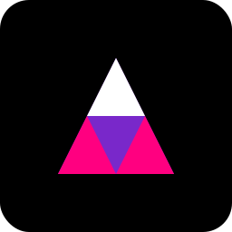

<p align="center">
  
  <h1 align="center">Next-Lite</h1>
</p>

<p align="center">
  <a aria-label="NPM version" href="https://www.npmjs.com/package/next-lite-framework">
    
  </a>
  <a aria-label="License" href="https://github.com/Nom-nom-hub/next-lite-main/blob/main/LICENSE">
    
  </a>
  <a aria-label="Join the community on GitHub" href="https://github.com/Nom-nom-hub/next-lite-main/discussions">
    
  </a>
</p>

<p align="center">
  <b>Next-Lite is a lightweight, high-performance alternative to Next.js built with esbuild.</b><br>
  Features file-based routing, HMR, CSS Modules, and TypeScript support out of the box,<br>
  all while maintaining a minimal footprint and blazing-fast build times.
</p>

## Getting Started

Visit the [Next-Lite GitHub repository](https://github.com/Nom-nom-hub/next-lite-main) to get started with Next-Lite.

## Documentation

Visit the [Next-Lite documentation](https://github.com/Nom-nom-hub/next-lite-main/tree/main/docs) to view the full documentation.

## Next-Lite: The React Framework for Performance

Next-Lite is a lightweight, high-performance React framework that prioritizes speed and simplicity. Built with esbuild at its core, Next-Lite offers a streamlined development experience while maintaining the essential features modern web developers need.

### Key Features

Next-Lite is designed to provide a fast, lightweight, and developer-friendly experience. Here are some of the key features:

- **Blazing Fast Build Times** - Built on esbuild, offering build times up to 100x faster than traditional bundlers
- **Zero Configuration** - Start coding immediately with sensible defaults
- **Minimal Bundle Size** - Optimized for production with code splitting and tree shaking
- **Developer Experience** - Hot Module Replacement with state preservation and enhanced error overlay
- **Flexible Rendering** - Support for Client-Side Rendering, Server-Side Rendering, and Static Site Generation
- **File-Based Routing** - Intuitive routing based on your file structure with dynamic route support
- **API Routes** - Create API endpoints easily within your Next-Lite application
- **TypeScript Support** - First-class TypeScript support with enhanced developer experience
- **CSS Modules** - Built-in support for CSS Modules and global styles
- **Environment Variables** - Simple environment configuration for all environments
- **Plugin System** - Extend functionality with a powerful plugin ecosystem
- **DevTools** - Built-in developer tools for debugging and performance monitoring

## Quick Start

To get started with Next-Lite, run the following commands:

```bash
# Create a new Next-Lite app
npx create-next-lite-app my-app

# Navigate to your app
cd my-app

# Start the development server
npm run dev
```

Visit [http://localhost:3000](http://localhost:3000) to see your app in action.

## Learn Next-Lite

To learn more about Next-Lite, take a look at the following resources:

- [Next-Lite Documentation](https://github.com/Nom-nom-hub/next-lite-main/tree/main/docs) - learn about Next-Lite features and API.
- [Learn Next-Lite](https://github.com/Nom-nom-hub/next-lite-main/tree/main/examples) - an interactive Next-Lite tutorial.

You can check out [the Next-Lite GitHub repository](https://github.com/Nom-nom-hub/next-lite-main) - your feedback and contributions are welcome!

## Deploy on Vercel

The easiest way to deploy your Next-Lite app is to use the [Vercel Platform](https://vercel.com/new?utm_source=github&utm_medium=readme&utm_campaign=next-lite) from the creators of Next.js.

Check out our [Next-Lite deployment documentation](https://github.com/Nom-nom-hub/next-lite-main/tree/main/docs/deployment.md) for more details.

## Project Structure

```
my-app/
├── pages/           # Your application pages
│   ├── index.tsx    # Homepage
│   ├── about.tsx    # About page
│   └── api/         # API routes
├── public/          # Static files
├── styles/          # CSS styles
├── components/      # React components
├── lib/             # Utility functions
├── next-lite.config.js  # Next-Lite configuration
└── package.json
```

## CLI Commands

```bash
# Development
npm run dev              # Start development server with HMR
npm run dev -- --devtools  # Start with DevTools enabled

# Building
npm run build            # Build for production (CSR)
npm run build -- --ssr     # Build with server-side rendering
npm run build -- --static  # Build as static site
npm run build -- --analyze # Analyze bundle size

# Production
npm start                # Start production server
npm start -- --ssr         # Start with SSR enabled

# Testing
npm run lint             # Run linter
npm test                 # Run tests
```

## Performance Comparison

| Feature              | Next-Lite | Next.js |
|---------------------|-----------|---------|
| Dev Startup Time    | ~300ms    | ~3s     |
| Production Build    | ~2s       | ~20s    |
| Bundle Size (Base)  | ~80KB     | ~200KB  |
| Memory Usage (Dev)  | ~200MB    | ~500MB  |
| SSR Support         | ✅        | ✅      |
| Static Generation   | ✅        | ✅      |
| CSS Modules         | ✅        | ✅      |
| TypeScript Support  | ✅        | ✅      |
| API Routes          | ✅        | ✅      |
| File-Based Routing  | ✅        | ✅      |
| HMR Support         | ✅        | ✅      |
| DevTools Support    | ✅        | ❌      |


## Ecosystem

| Package | Description |
|---------|-------------|
| [next-lite-framework](https://www.npmjs.com/package/next-lite-framework) | Core framework package |
| [create-next-lite-app](https://www.npmjs.com/package/create-next-lite-app) | Create Next-Lite apps with one command |
| [next-lite-plugin-seo](https://github.com/Nom-nom-hub/next-lite-main/tree/main/plugins/seo-plugin.js) | SEO optimization plugin |
| [next-lite-plugin-pwa](https://github.com/Nom-nom-hub/next-lite-main/tree/main/plugins/pwa-plugin.js) | Progressive Web App support |
| [next-lite-plugin-auth](https://github.com/Nom-nom-hub/next-lite-main/tree/main/plugins/auth-plugin.js) | Authentication plugin |

## Examples

Explore our [examples directory](https://github.com/Nom-nom-hub/next-lite-main/tree/main/examples) to see Next-Lite in action:

- [Basic App](https://github.com/Nom-nom-hub/next-lite-main/tree/main/examples/basic)
- [Blog Template](https://github.com/Nom-nom-hub/next-lite-main/tree/main/examples/blog)
- [Dashboard Template](https://github.com/Nom-nom-hub/next-lite-main/tree/main/examples/dashboard)
- [Data Fetching](https://github.com/Nom-nom-hub/next-lite-main/tree/main/examples/data-fetching)
- [Plugins](https://github.com/Nom-nom-hub/next-lite-main/tree/main/examples/plugins)
- [Tailwind CSS Integration](https://github.com/Nom-nom-hub/next-lite-main/tree/main/examples/tailwind)
- [Redux Integration](https://github.com/Nom-nom-hub/next-lite-main/tree/main/examples/redux)
- [GraphQL Integration](https://github.com/Nom-nom-hub/next-lite-main/tree/main/examples/graphql)

## Contributing

We welcome contributions to Next-Lite! Please see our [contributing guidelines](CONTRIBUTING.md) for more details.

## Authors

- **Teck Mill** ([@teckmill](https://github.com/teckmill))

## License

Next-Lite is [MIT licensed](LICENSE).

---

<p align="center">
  <a href="https://github.com/Nom-nom-hub/next-lite-main/stargazers">
    
  </a>
</p>

<p align="center">
  <a href="https://github.com/Nom-nom-hub/next-lite-main/issues">
    
  </a>
</p>

<p align="center">
  <a href="https://github.com/Nom-nom-hub/next-lite-main/pulls">
    
  </a>
</p>

<p align="center">
  <a href="https://github.com/Nom-nom-hub/next-lite-main/blob/main/LICENSE">
    
  </a>
</p>

<p align="center">
  <a href="https://github.com/Nom-nom-hub/next-lite-main/graphs/contributors">
    
  </a>
</p>

